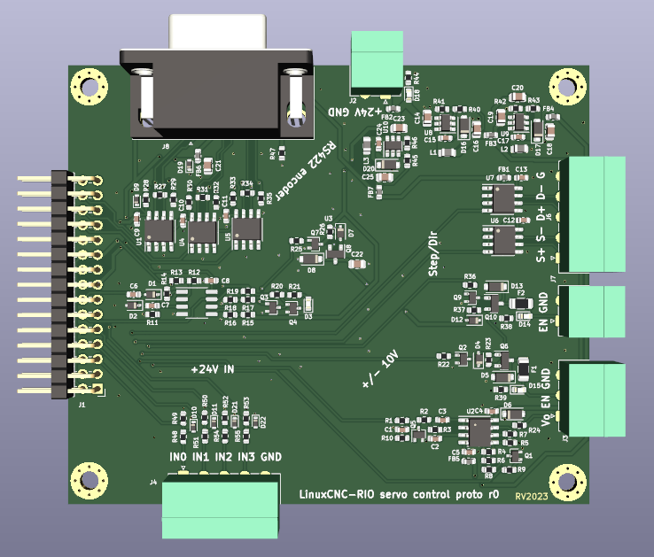

# LinuxCNC-RIO evaluation/prototype board

This repository contains a quick&dirty board to evaluate feasibility of using [LinuxCNC-RIO](https://github.com/multigcs/LinuxCNC-RIO) for analog servo motor control.
The board is designed as an addon for [Colorlight i5](https://tomverbeure.github.io/2021/01/22/The-Colorlight-i5-as-FPGA-development-board.html) development board. 

Design contains:
* +/-10V analog output (from pwmdir input) + 24V enable output
* differential step/dir + single ended 24V enable output
* differential encoder input on DB9 connector (RS422) with index pulse. Pinout for Ditron DC10 linear scale.
* 4 single ended 24V inputs (limit switches, EStop)
* +24V input, +5V, +/- 15V outputs for development board and analog output.

__N.B.__: There is no isolation present on the board, it relies on the Ethernet isolation alone!

## Current state

The design is not verified in real hardware yet, proceed with caution. Some aspects of the design were simulated in LTSpice, see `ltspice/`

